# MatPlotLib

## Tutorial 1

```python
# Date 15-06-2021

import matplotlib.pyplot as plt

plt.plot([-2, -4, -1, -2,  5,  2, -6], [-6,  0, 10,  3,  2,  0, -4])


plt.show()
```

### The above code will produce the following output

## 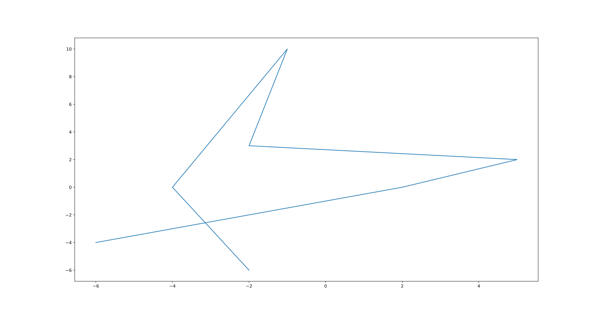

---

---

---

---

---

## Tutorial 2_1

```python
# Date 16-06-2021

import matplotlib.pyplot as plt

x = [0,  10,  -4,  -2,   5]
y = [1,   3,  -4, -5,   1]

x2 = [9, -10,   2,  -9,  -1]
y2 = [6,  -8,   7,  -1,  -3]


plt.plot(x, y, label='first plot')
plt.plot(x2, y2, label='second plot')
plt.xlabel('X Label')
plt.ylabel('Y Label')
plt.title('This is a title\nSub title')

plt.show()
```

### The above code will produce the following output

## 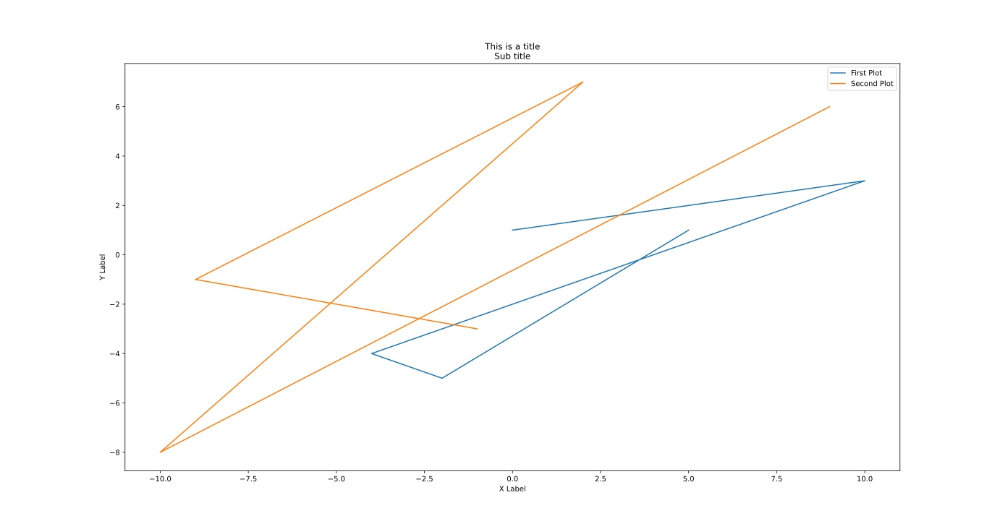

---

## Tutorial 2_2

```python
# Date 16-06-2021

import matplotlib.pyplot as plt

x = [1,  2,  3,  4,   5, 6, 7]
y = [1,  2,  3,  4,   5, 6, 7]


x2 = [1,  2,  3,  4,   5, 6, 7]
y2 = [0,  1,  2,  3,   4, 5, 6]


plt.plot(x, y, label='first plot')
plt.plot(x2, y2, label='second plot')
plt.xlabel('X Label')
plt.ylabel('Y Label')
plt.title('This is a title\nSub title')

plt.show()
```

### The above code will produce the following output

## 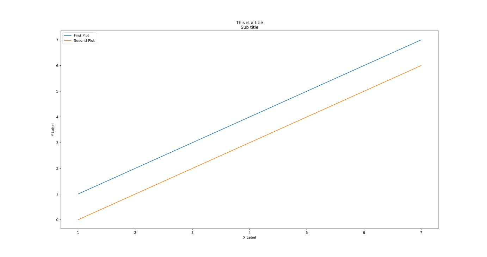

---

---

---

---

---

## Tutorial 3_1

```python
# Date 16-06-2021

import matplotlib.pyplot as plt

x = [8,   0,   2,  5,   7]
y = [3,   6,   2,  5,  10]

x2 = [8,  10,   5,  6,   3]
y2 = [8,  4,   6,  2, 4]


plt.bar(x, y, label='Graph 1', color='g')
plt.bar(x2, y2, label='Graph 2', color='r')

plt.xlabel('X Label')
plt.ylabel('Y Label')
plt.title('Bar Graphs')
plt.legend()
plt.show()
```

### The above code will produce the following output

## 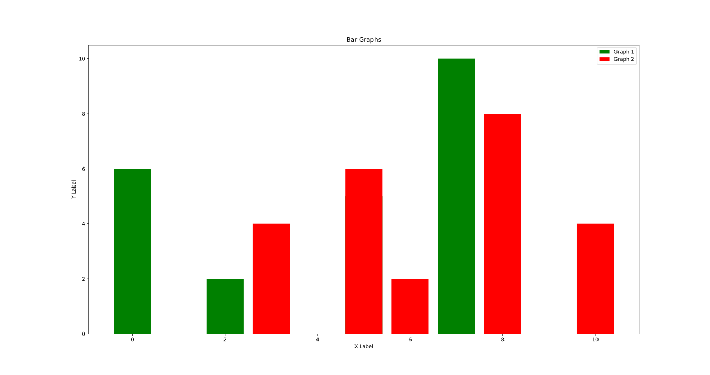

---

## Tutorial 3_2

```python
# Date 16-06-2021

import matplotlib.pyplot as plt

ages = [84,40,23,44,91,36,60,94,72,39,32,5,119,
        61,127,76,61,92,41,18,12,55,117,90,47,70,
        108,97,8,40,34,43,130,109,129,115,64,113,99,
        61,10,7,38,53,124,80,46,60,48,61,102,31,
        4,100,30,99,115,114,19,9]


x_axis = [0, 10, 20, 30, 40, 50, 60, 70, 80, 90, 100, 110, 120, 130]

plt.hist(ages, x_axis, histtype='bar', rwidth=0.9, color='#BC0786')

plt.xlabel('X Label')
plt.ylabel('Y Label')
plt.title('Histogram')
# plt.legend()
plt.show()
```

### The above code will produce the following output

## 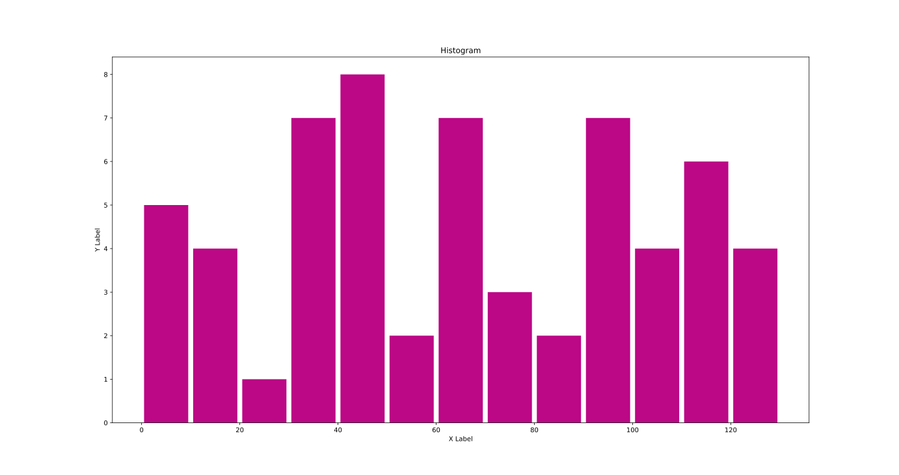

---

---

---

---

---

## Tutorial 4_1

```python
# Date 16-06-2021

import matplotlib.pyplot as plt

x = [8,   0,   2,  5,   7]
y = [3,   6,   2,  5,  10]

x2 = [8,  10,   5,  6,   3]
y2 = [8,  4,   6,  2, 4]


plt.bar(x, y, label='Graph 1', color='g')
plt.bar(x2, y2, label='Graph 2', color='r')

plt.xlabel('X Label')
plt.ylabel('Y Label')
plt.title('Scatter Plots')
plt.legend()
plt.show()
```

### The above code will produce the following output

## 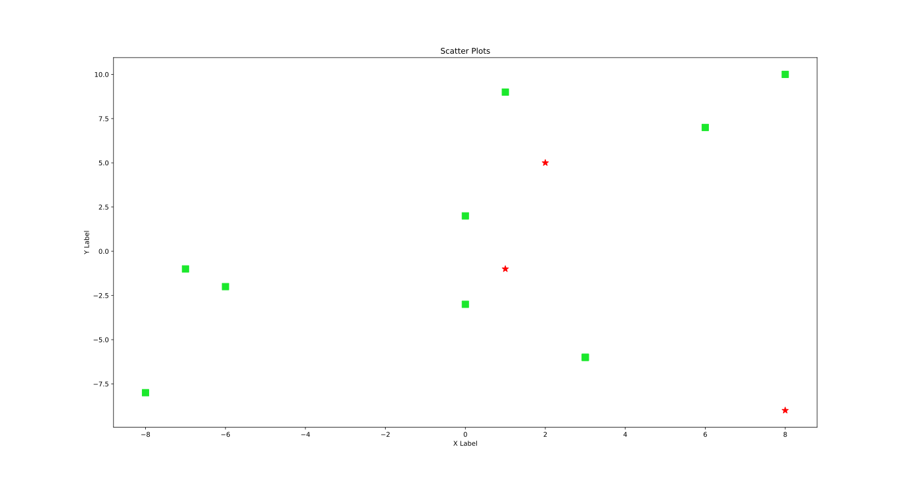

---

## Tutorial 4_2

```python
# Date 16-06-2021


import matplotlib.pyplot as plt
from random import shuffle
from random import randint as rd


def rd_color():

    random_number = rd(0, 16777215)
    hex_number = str(hex(random_number))
    hex_number = '#' + hex_number[2:]
    return hex_number


def sh():
    global x, y
    x_y_for_function = [1, -2, 3, -4, 5, -6, 7, -8,
                        9, -10, -1, 2, -3, 4, -5, 6, -7, 8, -9, 10]
    shuffle(x_y_for_function)
    x = x_y_for_function[:10]
    shuffle(x_y_for_function)
    y = x_y_for_function[:10]


x = []
y = []


sh()
plt.scatter(x, y, color=rd_color(), marker='>', s=rd(30, 45))

sh()
plt.scatter(x, y, color=rd_color(), marker='<', s=rd(30, 45))

sh()
plt.scatter(x, y, color=rd_color(), marker='X', s=rd(30, 45))

sh()
plt.scatter(x, y, color=rd_color(), marker='x', s=rd(30, 45))

sh()
plt.scatter(x, y, color=rd_color(), marker='1', s=rd(30, 45))

sh()
plt.scatter(x, y, color=rd_color(), marker='4', s=rd(30, 45))

sh()
plt.scatter(x, y, color=rd_color(), marker='8', s=rd(30, 45))

sh()
plt.scatter(x, y, color=rd_color(), marker='s', s=rd(30, 45))

sh()
plt.scatter(x, y, color=rd_color(), marker='p', s=rd(30, 45))

sh()
plt.scatter(x, y, color=rd_color(), marker='$a$', s=rd(30, 45))

sh()
plt.scatter(x, y, color=rd_color(), marker='$Q$', s=rd(30, 45))

plt.xlabel('X Label')
plt.ylabel('Y Label')
plt.title('Scatter Plots')
#! plt.legend()
plt.show()
```

### The above code will produce the following output

## 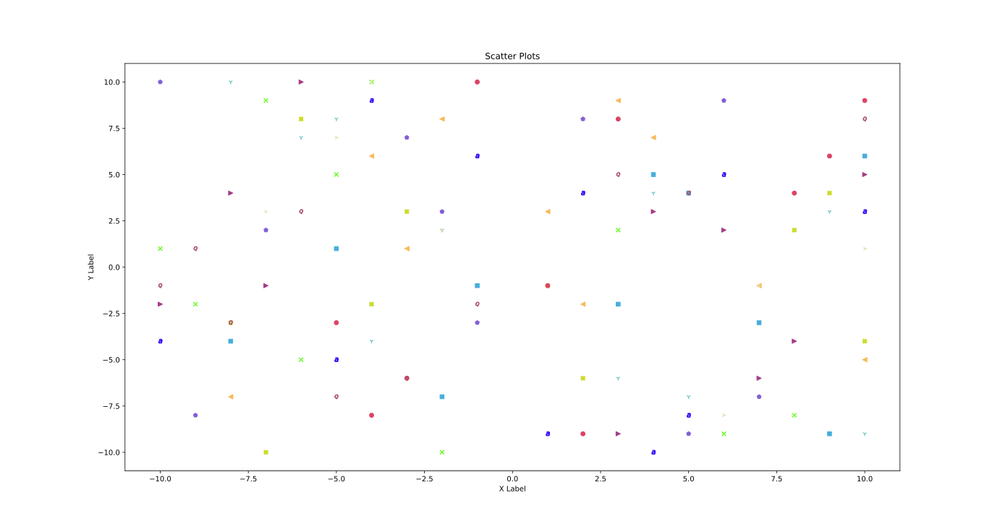

---

---

---

---

---

## Tutorial 5_1

```python
# Date 16-06-2021

import matplotlib.pyplot as plt

days = [1, 2, 3, 4, 5, 6, 7]

playing = [7,  9, 14, 9, 13,  4,  7]
eating = [5, 1, 1, 3, 5, 4, 3]
working = [14,  7,  6, 14, 11,  7,  7]
programming = [1, 1, 4, 1, 3, 4, 2]
sleeping = [5,  11,  8,  6, 10, 11,  9]


plt.stackplot(days, programming, playing, eating, working,
              sleeping, colors=['#A8FC00', '#00C5FC', '#EF4AA5', '#6BB7EA', '#48DBAF'])

plt.xlabel('X Label')
plt.ylabel('Y Label')
plt.title('Stack Plots')
plt.show()
```

### The above code will produce the following output

## 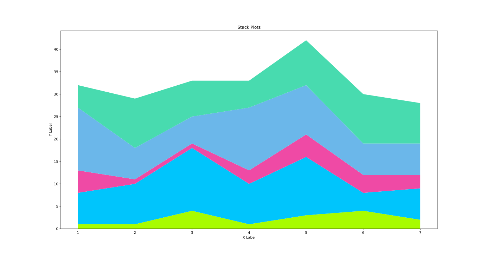

---

## Tutorial 6_2

```python
# Date 16-06-2021

'''
let's make a pie chart of the following data
study           04
sleep           11
programming     05
eating          03
exercise        01
total           24
'''

import matplotlib.pyplot as plt

import matplotlib.pyplot as plt

data = [4, 11, 5, 3, 1]
data_is_of_what = ['Study', 'Sleep', 'Programming', 'Eating', 'Exercise']

colours = ['#A8FC00', '#00C5FC', '#EF4AA5', '#6BB7EA', '#48DBAF']

plt.pie(data,
        labels=data_is_of_what,
        colors=colours,
        startangle=90,
        shadow=True,
        autopct='%1.2f%%',
        explode=(0, 0, 0, .09, 0))


plt.title('Pie Chart')
# plt.legend()
plt.show()
```

### The above code will produce the following output

## 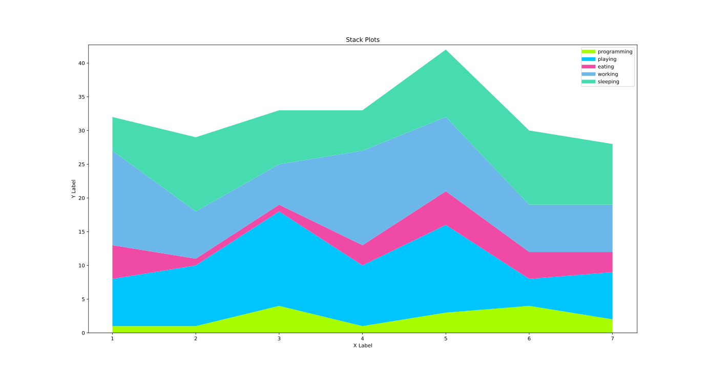

---

---

---

---

---

## Tutorial 5_1

```python
# Date 16-06-2021

'''
let's make a pie chart of the following data
study           04
sleep           11
programming     05
eating          03
exercise        01
total           24
'''

import matplotlib.pyplot as plt

import matplotlib.pyplot as plt

data = [4, 11, 5, 3, 1]
data_is_of_what = ['Study', 'Sleep', 'Programming', 'Eating', 'Exercise']

colours = ['#A8FC00', '#00C5FC', '#EF4AA5', '#6BB7EA', '#48DBAF']

plt.pie(data,
        labels=data_is_of_what,
        colors=colours,
        startangle=90,
        shadow=True)


plt.title('Pie Chart')
# plt.legend()
plt.show()
```

### The above code will produce the following output

## 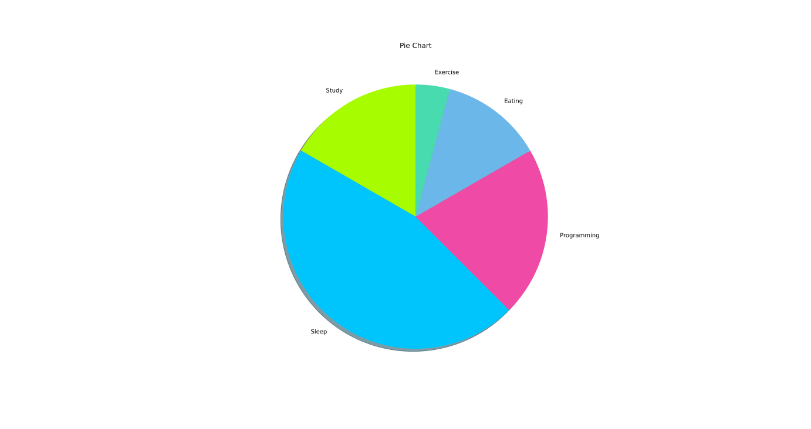

---

## Tutorial 5_2

```python
# Date 16-06-2021

import matplotlib.pyplot as plt

days = [1, 2, 3, 4, 5, 6, 7]

playing = [7,  9, 14, 9, 13,  4,  7]
eating = [5, 1, 1, 3, 5, 4, 3]
working = [14,  7,  6, 14, 11,  7,  7]
programming = [1, 1, 4, 1, 3, 4, 2]
sleeping = [5,  11,  8,  6, 10, 11,  9]

width = 7

plt.plot([], [], color='#A8FC00', label='programming', linewidth=width)
plt.plot([], [], color='#00C5FC', label='playing', linewidth=width)
plt.plot([], [], color='#EF4AA5', label='eating', linewidth=width)
plt.plot([], [], color='#6BB7EA', label='working', linewidth=width)
plt.plot([], [], color='#48DBAF', label='sleeping', linewidth=width)

plt.stackplot(days, programming, playing, eating, working,
              sleeping, colors=['#A8FC00', '#00C5FC', '#EF4AA5', '#6BB7EA', '#48DBAF'])

plt.xlabel('X Label')
plt.ylabel('Y Label')
plt.title('Stack Plots')
plt.legend()
plt.show()
```

### The above code will produce the following output

## 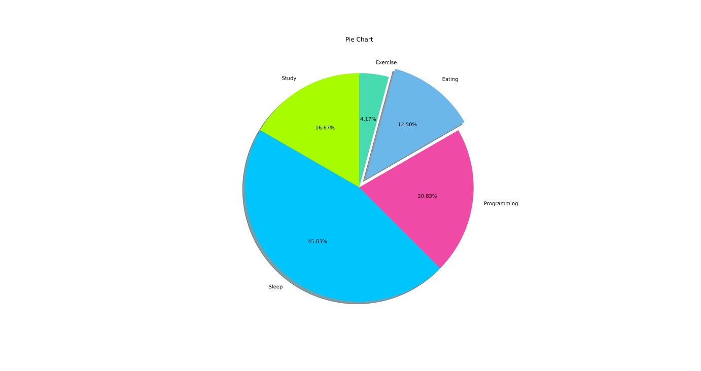
